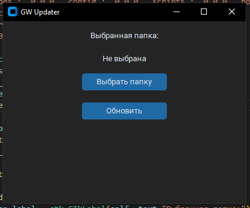
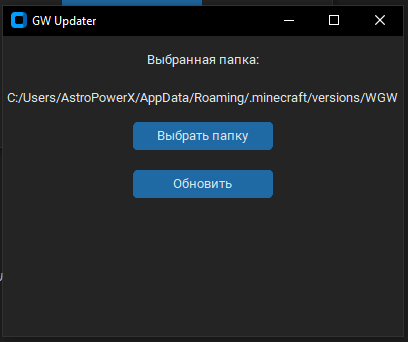
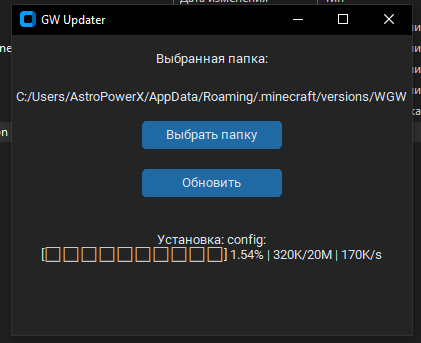
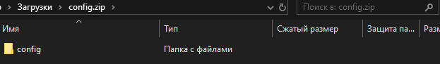
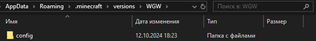
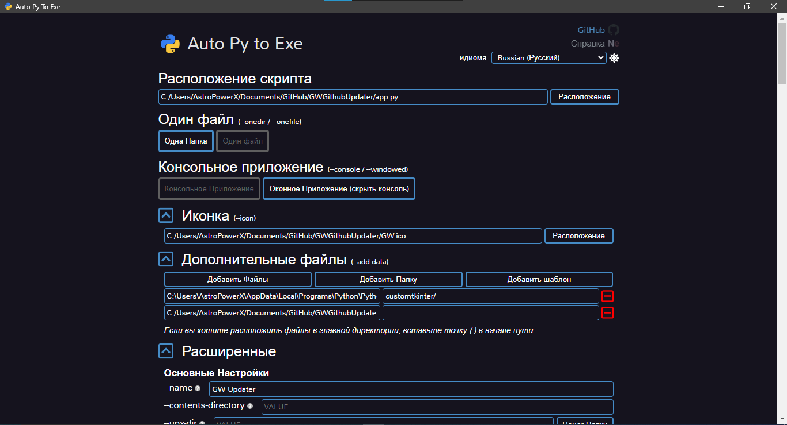

# GWUpdater By AstroPowerX

Приложение для обновления сборки GW!

### ВАЖНО! Это ПО НЕ УСТАНАВЛИВАЕТ MINECRAFT ОНО ЛИШЬ УСТАНАВЛИВАЕТ ФАЙЛЫ НУЖНЫЕ ДЛЯ РАБОТЫ СБОРКИ ДЛЯ ТОГО ЧТО-БЫ РАБОТАЛА СБОРКА НУЖНО ПРЕДВАРИТЕЛЬНО СОЗДАТЬ СБОРКУ И ВЫБРАТЬ ПАПКУ ГДЕ БЫЛА СОЗДАНА СБОРКА

#### Важно! Это не папка по типу `profiles` или `versions` ЭТО ПАПКА ВНУТРИ КОТОРОЙ САМА СБОРКА!!!

Например ModRinth Launcher

`...\ModRinthApp\profiles\GoodWars`

Или

`...\.minecraft\versions\GoodWars`

# Галерея:







# Хочу использовать для своих проектов!

**ВНИМАНИЕ**

Без Python 3.12 и выше у вас ничего не получится!!!
В консоль ввести

```bash
pip install customtkinter
pip install auto-py-to-exe
```

Для этого:

1. скачайте исходники
2. Откройте `app.py`
3. Там найдите участок кода

   ```python
   GITHUB_URL = 'https://github.com/good-wars/WorldChanges/raw/refs/heads/main/'
   APPSETTINGS = """{"filesDir": ""}"""
   VERSIONS = """{"mods": "0.0.0","config": "0.0.0","scripts": "0.0.0","hollowengine": "0.0.0"}"""
   DIRS = ["mods", "config", "scripts", "hollowengine"]
   NAME = "GW Updater"
   GEOMETRY = "400x300"
   ```
   Там измените
   `GITHUB_URL = '<Своя ссылка>'`

   Ссылка на репозиторий Github или любую другую платформу с подержкой открытия файлов в формате raw!

   ```python
   VERSIONS = """{"<Название Зип архива БЕЗ .zip>": "0.0.0","<Название Зип архива БЕЗ .zip>": "0.0.0","<Название Зип архива БЕЗ .zip>": "0.0.0","<Название Зип архива БЕЗ .zip>": "0.0.0", "И так далее": "0.0.0"}"""
   ```
   Название Зип архива БЕЗ .zip который на главной странице репозитоия
   `DIRS = ["mods", "config", "scripts", "hollowengine"]` Здесь в кавычках через запятую всё названия zip архивов БЕЗ .zip
   В репозитории который вы указали в `GITHUB_URL`. Нужно закинуть ZIP архивы всех папок указанных выше
   **ВНИМАНИЕ**
   ZIP архив распаковывается без создания новых папок т.е. он распаковываеся как обычный ZIP архив
   Например:
   config.zip должен иметь внутри папку config!
   

   Что-бы получилось так после установки:
   

   `NAME = "<Имя окна>"`
   ` GEOMETRY = "<Ширина>x<Высота>"`
   `ICON = "_internal/<имя.ico>"` Обязательно `_internal` т.к. программа при компиляции в 5 пункте попросту не запустится
4. В репозитории создайте файл `Versions.json`
   В нём напишите этот код

   ```json
   {
     "<Название Зип архива БЕЗ .zip>": "1.0.0", 
     "<Название Зип архива БЕЗ .zip>": "1.0.0", 
     "<Название Зип архива БЕЗ .zip>": "1.0.0", 
     "<Название Зип архива БЕЗ .zip>": "1.0.0",
     "И так далее": "1.0.0"
   }
   ```
   Что такое "1.0.0"?
   Это версия файлов она нужна для проверки обновился ли файл!
   Поэтому в `app.py` версия по умолчанию 0.0.0 т.к. файлов нет. Поэтому
   **ВАЖНО**
   **ВСЕГДА ОБНОВЛЯТЬ ЭТИ ВЕРСИИ!!!**
   Иначе никто не сможет обновить вашу чудесную сборку!
5. В итоге прописываем в CMD

   ```bash
   auto-py-to-exe
   ```
   Открывается окно
   

   Тут можно выбрать русский
   Выбераем расположение скрипта app.py
   
   Выбираем Одна папка
   

   Если надо иконку
   
   Тут уже важно! Выбераем добавить шаблон и вставляем путь к CustonTkinter
   Например `C:\Users\AstroPowerX\AppData\Local\Programs\Python\Python312\Lib\site-packages\customtkinter`
   После в поле с права пишем `customtkinter/`
   Что-бы программа работала нужно далее нажать Добавить файлы и там выбрать иконку приложения. А поле с права оставить таким какое оно есть
   
   В расширенных вы можете выбрать название exe файла
   
   Теперь нажимаем Синюю кнопку Конвертировать и ждём..
   
